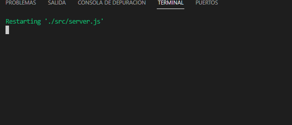

# Proyecto Final Argentina Programa 4.0 utilizando Node.JS, MySQL y Sequlize 
#### HERRERA NAHUEL RODRIGO

## Configuración


Asegúrate de realizar la configuración inicial antes de utilizar la API. Esto incluye la instalación de las dependencias y la configuración de variables de entorno. Puedes encontrar un archivo .env en la raíz del proyecto que contiene las variables de entorno necesarias. Antes de ejecutar la API, asegúrate de completar y configurar las variables de entorno en el archivo 


```shell
# Instalación de dependencias
npm i

# Instalación de squalize
npm install --save sequelize
npm install --save mysql2
```

## Para utilizar esta api debemos:
Ejecutar el escript para generarnos la base de datos, los inputs y la vista.
Este script se encuentra ens src/recursos_db/ y el archivo sera Crear DB y Vista tipojson.sql

Al ejecutarlo tenremos la base , los inputs y las vistas 

en esta misma carpeta se encuntra un diagrama de la Base y el json que se utilizo para pensar las relaciones y los inputs.


#### Estructura de directorios
``` tree
    ├── node_modules
    ├── src
    |   |──connection
    |   |    └──connection.js
    |   |──models
    |   |──catalogo.js
    |   |   |──categorias.js
    |   |   └──generos.js
    |   ├── recursos_db
    │   |    |── Crear DB y Vista tipo json,sql
    |   |    |── Diagrama_DB_trailerflix.jpg
    |   |    └── trailerflix_-_Clase_27 (1).json
    │   └── server.js
    |
    ├── .env
    ├── .env.dist
    ├── .gitignore
    ├── package.json
    ├── package-lock.json 
    └── README.md
```
Va a quedarsin el .env lo creamos y definimos de la sifuiente forma

### Variables de Entorno

Este proyecto se utiliza con variables de entorno para personalizar y configurar aspectos específicos de su funcionamiento. A continuación, se detallan las variables de entorno requeridas y su descripción:

- **PORT**: El puerto en el que la aplicación se ejecutará. Aqui tienes que poner el puerto que deceas utilizar .

    ```shell
    PORT="Tu Puerto"
    recomendamos que el port sea 8080
    ```

- **HOST**: La dirección IP o el host en el que la aplicación sera ejecutado, para este proyecrto levantamos el server en nuestras maquinos por lo que se utilizara el localhost

    ```shell
    HOST="tu local host o el host que elijas"
    recomendamos que el HOST sea localhost que seria equivalente a 127.0.0.1
    ```

- **DATABASE**: El nombre de la base de datos.

    ```shell
    DATABASE="Nombre De la Base" //en este caso sera trailerflix 
    ```

- **DBUSER**: Nombre de usuario de tu base de datos.

    ```shell
    DBUSER="Tu Nombre De Usuario"
    ```

- **PASSWORD**: La contraseña de tu Base de datos

    ```shell
    PASSWORD="aqui ingresaras tu contraseeña de DB"
    ```


Asegúrate de configurar estas variables de entorno correctamente en tu archivo `.env` antes de iniciar la aplicación.

## Inicialización del Servidor

Al haber seguido todos los pasos tendra que ejecutar el siguiente comando para que te levante 
npm run start y ahi utilizaras los endpoints que quieras.

## Endpoints

Todas las rutas utilizadas en este proyecto son los gets, los cuales devolveran una repsuesta en formato json con su respectivo manejo de errores.

---

## Endpoint `/catalogo`

El endpoint /catalogo ofrece las siguientes funcionalidades:

## *Se utilizarain el localhost y el port 8080 para los ejemplos*
#### Métodos HTTP
| Tipo | URI | Descripción |
|------|-----|-------------|
| GET | `http://localhost:8080/categorias`| Obtiene todas las categorias
| GET | `http://localhost:8080//catalogo`| Obtienen todas las peliculas y series |
| GET | `http://localhost:8080/catalogo/:id`| Obtienen la peliculas o serie con el id dado | específico |
| GET | `http://localhost:8080/catalogo/nombre/:nombre` | Obtiene un registro que tenga el nombre o una parte de el, sino la tiene da un cartel con error |
| GET | `http://localhost:8080/catalogo/categoria/:categoria` | Obtiene una lista que contenga el registro dado o una parte que coincida con el, sino la tiene da un cartel con error |
| GET | `http://localhost:8080/generos`| Obtiene todos los generos


hay 2 tipos con parametros y sin parametros.

#### Los metodos GET con parametros


Los que son con paramaetros son: 
  http://localhost:8080/catalogo/:id
  http://localhost:8080/catalogo/nombre/:nombre
  http://localhost:8080/catalogo/categoria/:categoria

- Request:
  - Parámetros opcionales de tipo PARAMS: segun las urls que deje todoas tienen catalogo/:parmas
  funcionan de la misma forma le habilitas una id, nombre, geneo o categoria y retorna si lo encuentra, datos que coiobnciden o sino lo encuentra su respectivo mensaje 


  -Respuestas:
  
      localhost:8080/catalogo/1

      {
            "id": 1,
            "poster": "http://127.0.0.1:3005/public/posters/1.jpg",
            "titulo": "The Crown",
            "categoria": "Serie",
            "genero": "Drama,Hechos Verídicos",
            "resumen": "Este drama narra las rivalidades políticas y el romance de la reina Isabel II, así como los sucesos que moldearon la segunda mitad del siglo XX.",
            "temporadas": "4",
            "reparto": "Claire Fox,Olivia Colman,Matt Smith,Tobias Menzies,Vanesa Kirby,Helena Bonham Carter",
            "trailer": null
      }

   -Código HTTP: **200** Devuelve el ejemplo de arriba o sea los datos de la peli o seire 

   -Código HTTP: **400** Message: ID de película/serie no válido

   -Código HTTP: **404** Message: Elemento no encontrado

   -Código HTTP: **500** Message: Error interno del servidor 


      localhost:8080/catalogo/nombre/river

       {

          "id": 2,
          "titulo": "Riverdale",
          "categoria": "Serie",
          "genero": "Ciencia Ficción, Drama, Misterio",
          "resumen": "El paso a la edad adulta incluye sexo, romance, escuela y familia. Para Archie y sus amigos, también hay misterios oscuros.",
          "temporadas": 5,
          "reparto": "Camila Mendes, Casey Cott, Lili Reinhart, Mädchen Amick, Madelaine Petsch, Marisol Nichols",
          "poster": "/posters/2.jpg",
          "trailer": null
        }...

   -Código HTTP: **200** Devuelve datos de las pelis o seires que coincidan como el json de arriba

   -Código HTTP: **400** Message: No se encontraron películas/series con ese nombre 

   -Código HTTP: **404** Message: Nombre de película/serie no válido.

   -Código HTTP: **500** Message: Error interno del servidor 
   
      localhost:8080/catalogo/genero/Ciencia

      {
          "id": 2,
          "titulo": "Riverdale",
          "categoria": "Serie",
          "genero": "Ciencia Ficción, Drama, Misterio",
          "resumen": "El paso a la edad adulta incluye sexo, romance, escuela y familia. Para Archie y sus amigos, también hay misterios oscuros.",
          "temporadas": 5,
          "reparto": "Camila Mendes, Casey Cott, Lili Reinhart, Mädchen Amick, Madelaine Petsch, Marisol Nichols",
          "poster": "/posters/2.jpg",
          "trailer": null
      }...

   -Código HTTP: **200** Devuelve datos de las pelis o seires que coincidan como el json de arriba

   -Código HTTP: **400** Message: Género no válido

   -Código HTTP: **404** Message: No se encontraron películas/series con ese género.

   -Código HTTP: **500** Message: Error interno del servidor 

   
   
      localhost:8080/catalogo/categoria/peli

      {
        "id": 6,
        "titulo": "Enola Holmes",
        "categoria": "Pelicula",
        "genero": "Drama, Ficción, Misterio",
        "resumen": "La hermana menor de Sherlock, descubre que su madre ha desaparecido y se dispone a encontrarla. En su búsqueda, saca a relucir el sabueso que corre por sus venas y se encuentra con una conspiración que gira en torno a un misterioso lord, demostrando que su ilustre hermano no es el único talento en la familia.",
        "temporadas": null,
        "reparto": "Adeel Akhtar, Helena Bonham Carter, Henry Cavill, Millie Bobby Brown, Sam Claflin",
        "poster": "/posters/6.jpg",
        "trailer": null
      }...

   -Código HTTP: **200** Devuelve datos de las pelis o seires que coincidan como el json de arriba

   -Código HTTP: ***400*** Message: Categoría no válida

   -Código HTTP: **404** Message: No se encontraron películas/series con esa categoría.

   -Código HTTP: **500** Message: Error interno del servidor 


#### Método GET  Sin parametros :

- Request:
 aca incluyo las url que no tienen parametroas esto lo que rtetornara seran todos los elementos de la seleccion que hacemos en la url 
 las urls son:; 
 localhost:8080/categorias
 localhost:8080/catalogo
 localhost:8080/generos
     
  -Respuestas:

   
      localhost:8080/categorias

      {
        "categoria_id": 1,
        "categoria_nombre": "Serie"
      },
      {
        "categoria_id": 2,
        "categoria_nombre": "Pelicula"
      }

   -Código HTTP: **200** Devuelve las categorias que son 2 

   -Código HTTP: **500** Message: Error interno del servidor 
   
      localhost:8080/catalogo

      {
        "id": 35,
        "titulo": "Titanes del pacífico - La insurrección",
        "categoria": "Pelicula",
        "genero": "Acción, Fantasía, Sci-Fi",
        "resumen": "Han pasado 10 años tras la primera invasión que sufrió la humanidad, pero la lucha aún no ha terminado. El planeta vuelve a ser asediado por los Kaiju, una raza de alienígenas colosales, que emergen desde un portal interdimensional con el objetivo de destruir a la raza humana. Ante esta nueva amenaza, los Jaegers, robots gigantes de guerra pilotados por dos personas para sobrellevar la inmensa carga neuronal que conlleva manipularlos, ya no están a la altura de lo que se les viene encima. Será entonces cuando los supervivientes de la primera invasión, además de nuevos personajes como el hijo de Pentecost, tendrán que idear la manera de sorprender al enorme enemigo, apostando por nuevas estrategias defensivas y de ataque. Con la Tierra en ruinas e intentando reconstruirse, esta nueva batalla puede ser decisiva para el futuro.",
        "temporadas": null,
        "reparto": "Burn Gorman, Cailee Spaeny, Jing Tian, John Boyega, Rinko Kikuchi, Scott Eastwood",
        "poster": "http://localhost:8080//posters/35.jpg",
        "trailer": null
        }....


   -Código HTTP: **200** Devuelve el catalogo entero de todas las pelis y sewries que estan en la base de datos como en el ejemplo de arriba con la ruta absoluta de los posters.

   -Código HTTP: **500** Message: Error interno del servidor 

      localhost:8080/generos

      {
        "generos_id": 1,
        "generos_nombre": "Ciencia Ficción"
      },
      {
        "generos_id": 2,
        "generos_nombre": "Fantasía"
      },
      {
        "generos_id": 3,
        "generos_nombre": "Drama"
      },
      {
        "generos_id": 4,
        "generos_nombre": "Ficción"
      }....


   -Código HTTP: **200** Devuelve todos los generos que estan en la base de datos en este ejemplo no puse  todos pero retorna todos los generos.

   -Código HTTP: **500** Message: Error interno del servidor 

Tambien hay manejo de rutas cuando la ruta ingresa es invaluida retorna un cartel diciendo `La URL indicada no existe en este servidor`


### Anotaciones De alumno

cuando se corre el proyecto hay un problema el cual no supe identificar porque sucede, cuando se hace el npm start aveces se bugea y queda en verde poniendo restarting server, lo que hago es bajar el server y despues volver a intentar conectar, y esperar un rato puede tarda hasta unos 3 minutos.

*ejemplo de bug*
()


### Deseo expresar mi más profundo agradecimiento a todos los profesores por la excepcional calidad de su enseñanza y la claridad con la que transmitieron los temas durante el curso.
### Ha sido un auténtico privilegio haber tenido la oportunidad de aprender de ustedes. Además, me gustaría destacar el esfuerzo y dedicación de mis compañeros, quienes demostraron ser verdaderos genios, por su buena onda y su forma en la que nos ayudamos y potenciamos mutuamente. Hemos conformado un grupo excepcional que hizo que esta experiencia fuera realmente enriquecedora.

## Espero que en el futuro tengamos la posibilidad de cruzar caminos nuevamente, ya sea en otro curso o, quién sabe, en un entorno de trabajo. Cada uno de ustedes, sin lugar a dudas, son auténticos expertos en su campo. Quiero expresar mi agradecimiento especial a Sergio, Fran, Dani y al profesor que sustituyó a Sergio (mis disculpas por olvidar su nombre), por su incansable dedicación y apoyo.

### Con gratitud, Herrera Nahuel